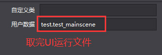

# UI帮助文件

## 注意事项
    1. 所有UI的缩放必须X和Y一样比例. 
    2. 除了滑动条可以旋转90度其它UI的旋转必须是0
    3. 不能翻转X和Y
    4. 不支持混合,不会导出混合效果
    5. 只有面板支持9宫格
    6. 交互性其实是enable(启用\禁用)
    7. 不支持改变颜色,在游戏中不会有效果

## 鼠标事件(所有UI支持下列鼠标事件)
必须开启交互性才能激活鼠标事件

1. 鼠标进入消息回调
~~~lua
function UI.UIBase:SetCallback_MouseEnter(fn)
~~~
2. 鼠标离开消息回调
~~~lua
function UI.UIBase:SetCallback_MouseLeave(fn)
~~~
3. 鼠标左键按下消息回调
~~~lua
function UI.UIBase:SetCallback_MouseLeftDown(fn)
~~~
4. 鼠标左键抬起消息回调
~~~lua
function UI.UIBase:SetCallback_MouseLeftUp(fn)
~~~
5. 鼠标左键按下消息回调
~~~lua
function UI.UIBase:SetCallback_MouseRightDown(fn)
~~~
6. 鼠标左键抬起消息回调
~~~lua
function UI.UIBase:SetCallback_MouseRightUp(fn)
~~~
7. 鼠标移动消息回调
~~~lua
function UI.UIBase:SetCallback_MouseMove(fn)
~~~
8. 鼠标齿轮消息回调
~~~lua
function UI.UIBase:SetCallback_MouseWheel(fn)
~~~
9. 鼠标单击消息回调
~~~lua
function UI.UIBase:SetCallback_MouseClick(fn)
~~~

## 场景
    相当于游戏中的GameUI

    打开编辑器
    这用户数据填写脚本名,在LoadScene完成后自动运行脚本文件

## 精灵 UI.Backdrop
    这个用来做帧动画

## 按钮 UI.Button
    显示状态只用作编辑器里查看

## 复选框 UI.CheckBox
    显示状态只用作编辑器里查看

## 图片 UI.ImageView
    不支持9宫格

## 文本 UI.Text
    在游戏中不显示可能是尺寸太小或字体不包含这个文字

## 文本 UI.Text
    不支持描边效果,交互动画
    在游戏中不显示文字可能是尺寸太小或字体不包含这个文字

## 进度条 UI.LoadingBar
    
## 滑动条 UI.Slider

## 输入框 UI.TextField
    不能放到面板里,不然不接受事件
    不支持密文
    可以用图片当背景,输入框放到图片下级

## 基础容器 UI.Panel
    不支持背景填充,游戏里不会有效果
    9宫格只支持4边为0拉伸模式

## 列表容器 UI.ListView
    不支持背景填充,游戏里不会有效果
    9宫格只支持4边为0拉伸模式

## 翻页容器 UI.PageView
    不支持背景填充,游戏里不会有效果
    9宫格只支持4边为0拉伸模式

## 滚动容器 UI.ScrollView
    不支持背景填充,游戏里不会有效果
    9宫格只支持4边为0拉伸模式